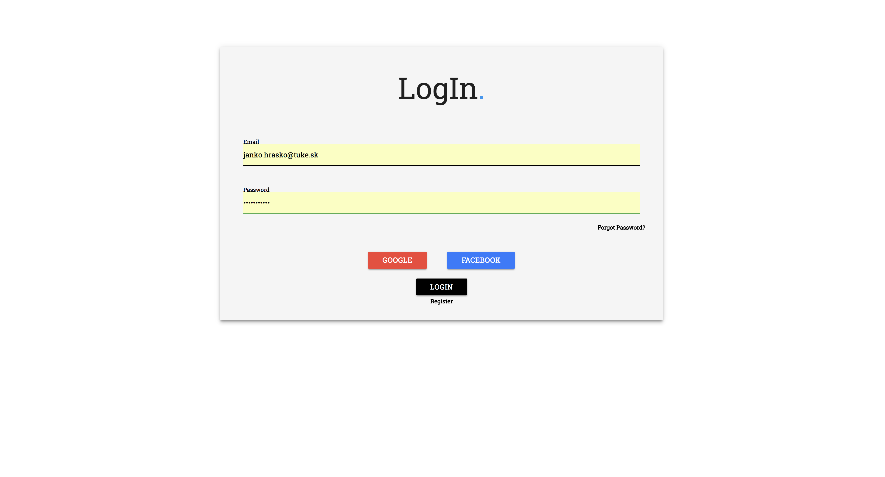
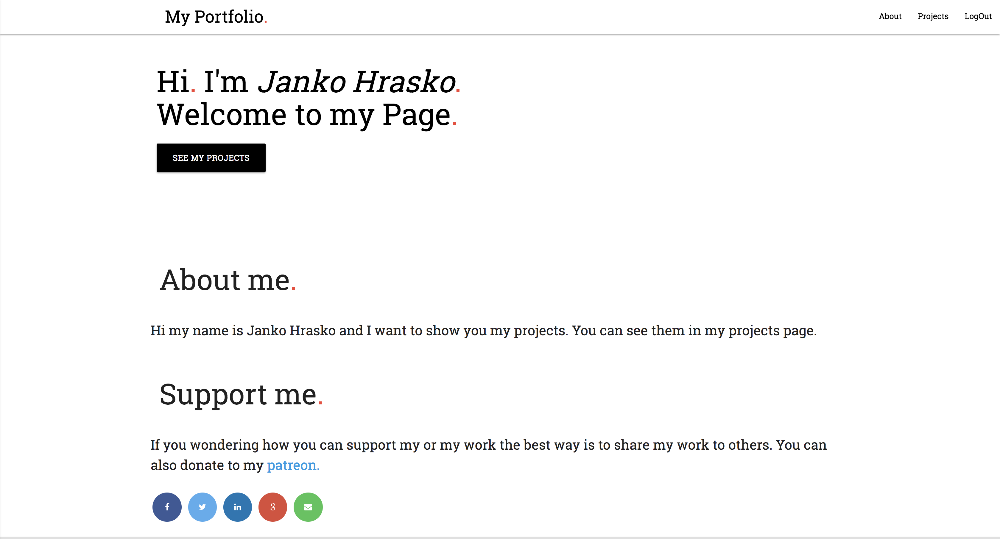
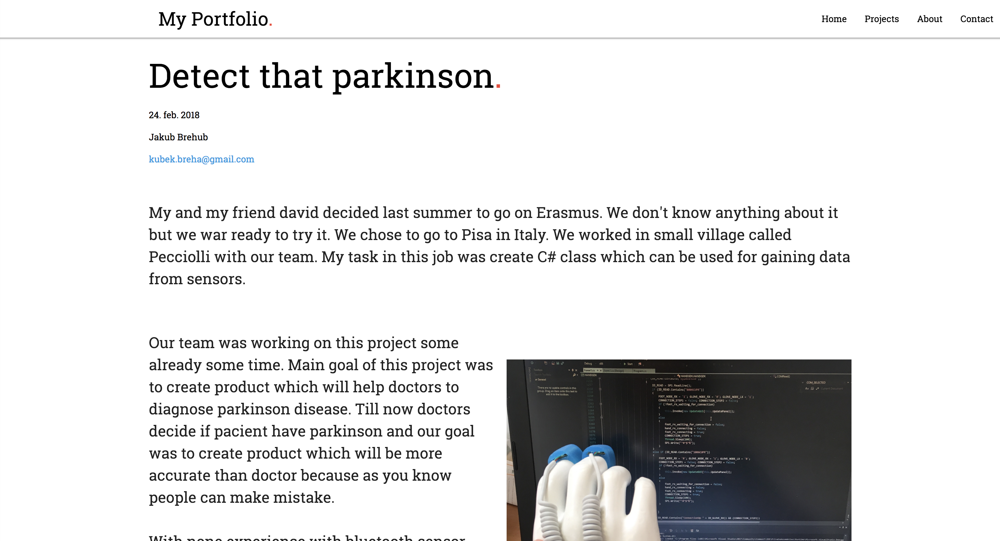

# MyPortfolio

This is one of my school project. You can find here Firebase login and articles and comments you can manage with REST methods. You can find
Ethereum miner here.

## Screenshots

  

## Using

* [Firebase](https://tympanus.net/codrops/) - Firebase login
* [Materialize](https://materializecss.com/) - Frontend framework

## License

This project is licensed under the MIT License - see the [LICENSE](https://github.com/kubekbreha/MyPortfolio/blob/master/LICENCE) file for details
